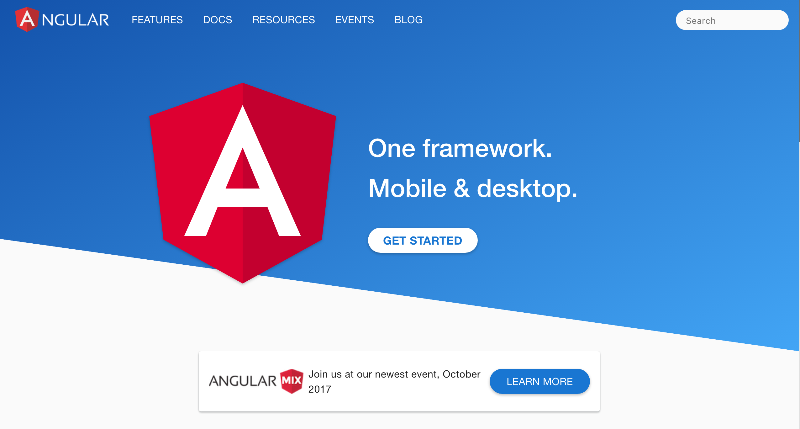
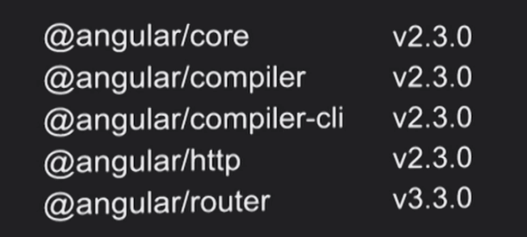
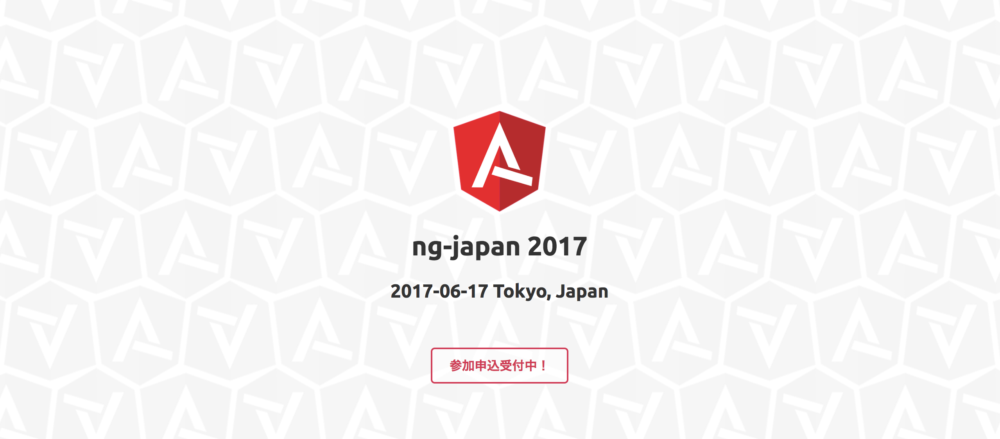

# Angular

## JavaScriptフレームワーク特集

Okachi.js vol.6 | 2017/06/16 | Masataka Arai

----

## お前誰よ？


* Masataka Arai [@massa142][1]
* [SQUEEZE Inc.][2]
* [Pythonもくもく会][3]
* PyCon JP スタッフ
* Okachi.js vol.0 から参加 (｀・ω・´)

[1]: http://massa142.github.io/
[2]: https://squeeze-inc.co.jp/
[3]: https://mokupy.connpass.com/

----



----

## 読み方

* Angular
* [æŋgjʊlɚ][1]
* あんぎゅらー
* AngularJS は 1系 を意味するように
* 2系以降は Angular って読んでね

[1]: http://ejje.weblio.jp/content/angular

-----

## 関連URL

* GitHub
  * https://github.com/angular
* Twitter
  * https://twitter.com/angular
* Angular公式ドキュメント
  * https://angular.io
* AngularJS公式ドキュメント
  * https://angularjs.org

-----

## リリース日
* Version 2
  * 2016/09/14
  * [Angular, version 2: proprioception-reinforcement][1]
* Version 4
  * 2017/03/23
  * [Angular 4.0.0 Now Available][2]
  
※ 内部の@angular/routerとリリースバージョンを揃えるために、Angular本体の Version 3 をスキップ  

[1]: http://angularjs.blogspot.jp/2016/09/angular2-final.html
[2]: http://angularjs.blogspot.jp/2017/03/angular-400-now-available.html

-----

## Angular 2



-----

## Angular 4

```
{
  "name": "sample",
  "version": "0.0.0",
  "license": "MIT",
  "scripts": {
    "ng": "ng",
    "start": "ng serve",
    "build": "ng build",
    "test": "ng test",
    "lint": "ng lint",
    "e2e": "ng e2e"
  },
  "private": true,
  "dependencies": {
    "@angular/animations": "^4.0.0",
    "@angular/common": "^4.0.0",
    "@angular/compiler": "^4.0.0",
    "@angular/core": "^4.0.0",
    "@angular/forms": "^4.0.0",
    "@angular/http": "^4.0.0",
    "@angular/platform-browser": "^4.0.0",
    "@angular/platform-browser-dynamic": "^4.0.0",
    "@angular/router": "^4.0.0",
    "core-js": "^2.4.1",
    "rxjs": "^5.1.0",
    "zone.js": "^0.8.4"
  },
  "devDependencies": {
    "@angular/cli": "1.1.1",
    "@angular/compiler-cli": "^4.0.0",
    "@angular/language-service": "^4.0.0",
    "@types/jasmine": "2.5.45",
    "@types/node": "~6.0.60",
    "codelyzer": "~3.0.1",
    "jasmine-core": "~2.6.2",
    "jasmine-spec-reporter": "~4.1.0",
    "karma": "~1.7.0",
    "karma-chrome-launcher": "~2.1.1",
    "karma-cli": "~1.0.1",
    "karma-jasmine": "~1.1.0",
    "karma-jasmine-html-reporter": "^0.2.2",
    "karma-coverage-istanbul-reporter": "^1.2.1",
    "protractor": "~5.1.2",
    "ts-node": "~3.0.4",
    "tslint": "~5.3.2",
    "typescript": "~2.3.3"
  }
}

```

-----

## リリースサイクル

* Semantic Versioning の導入
  * ** X . Y . Z **
  * `major`.`minor`.`patch`
* majorリリースは半年に１回
* minorリリースは月１回
* patchリリースは週１回
* [Versioning and Releasing Angular][1]

[1]: http://angularjs.blogspot.jp/2016/10/versioning-and-releasing-angular.html

-----

## ライセンス

* [MIT License][1]

[1]: https://github.com/angular/angular/blob/master/LICENSE

----

## 特徴

1. コンポーネント
2. DI(依存性注入)
3. 双方向データバインド
4. TypeScript推奨
5. 必要なものはだいたい揃ってる

-----

## 1. コンポーネント

+ HTML / CSS / JavaScript(TypeScript)
+ CSSのカプセル化はAngularがやってくれる

-----

## 2. DI(依存性注入)

+ コンポーネントは画面遷移のたびに生成・破棄される
+ その依存クラスははじめにインスタンス化されたら内部で保持
+ このクラスに依存してるコンポーネントが今後生成されたら、依存関係はDIで解決
  + 複雑な依存関係に対応
  + インスタンス化のオーバーヘッド解消

-----

## 2. DI(依存性注入)
  
  
```ts
import { Component }   from '@angular/core';
 
import { Hero }        from './hero';
import { HeroService } from './hero.service';
 
@Component({
  selector: 'hero-list',
  template: `
  <div *ngFor="let hero of heroes">
    {{hero.id}} - {{hero.name}}
  </div>
  `
})
export class HeroListComponent {
  heroes: Hero[];
 
  constructor(heroService: HeroService) {
    this.heroes = heroService.getHeroes();
  }
}
```

https://angular.io/guide/dependency-injection

-----

## 3. 双方向データバインド

+ ReactとかVue2.0のようなVirtualDOM方式ではない
+ ChangeDetectorがRealDOMの差分を検知する仕組み
+ パフォーマンスがよくないという声も

-----

## 4. TypeScript推し

+ 型っていいよね
+ JSのベストプラクティスを知らなくても書ける
  + 良し悪しだけどね

-----

## 5. 必要なものはだいたい揃ってる

+ angular-cli
  + webpackを内包
+ @angularパッケージ群
  + @angular/forms
  + @angular/router
  + などなど
+ Karma
  + 単体テストツール
+ Protractor
  + Angular専用のE2Eテストツール

----

## フルスタックですか？


----

## 事例

+ Google社内の200以上のアプリケーション
+ [NBA.com][1] で採用とのこと
  + *[ng-conf 2017 1日目 Keynoteメモ][2]*
+ [ReDoc][3]
  + *[ReDoc - Angular な静的 Webページを生成できる REST API ドキュメンテーションツール  - Witch on the Other Shore][4]*
+ SQUEEZEでも管理画面にAngular導入予定
  + 秋ごろには報告できるようにしたい

[1]: http://www.nba.com/
[2]: https://blog.lacolaco.net/post/ng-conf-2017-day-1-note/
[3]: https://github.com/Rebilly/ReDoc
[4]: http://blog.iktakahiro.sh/entry/2017/06/09/09000

----

## 良いところ
  * 必要なものが揃ってる
  * TypeScript推し
  * フルスタックフレームワーク
    * 専業フロントエンジニアでない開発者には嬉しい 😊

-----

## 悪いところ
  * Angular Way から外れようと思うと面倒
  * 破壊的アップデートの過去
  * フルスタックフレームワーク
    * 自由度が低いから嫌われることも 😵

----

## ng-japan 2017

明日これ行ってきます 🤗


